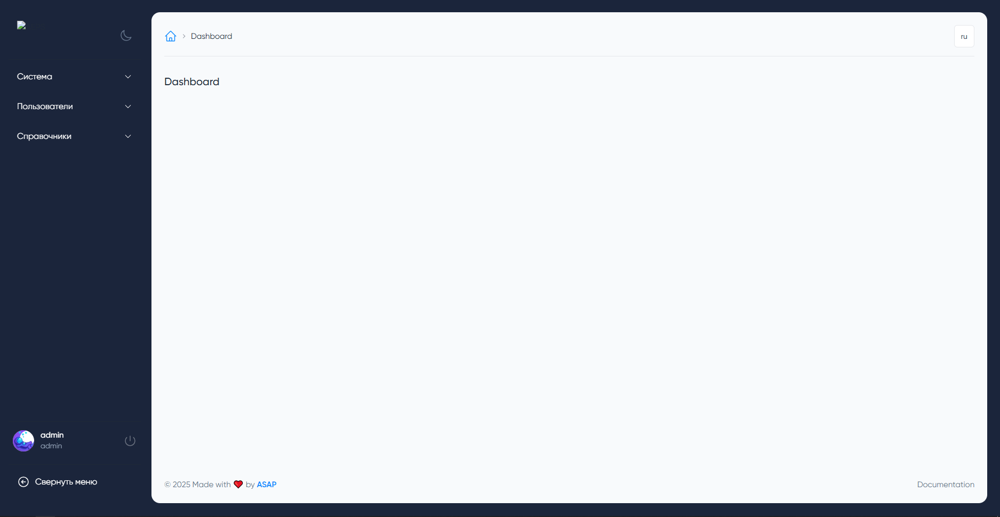
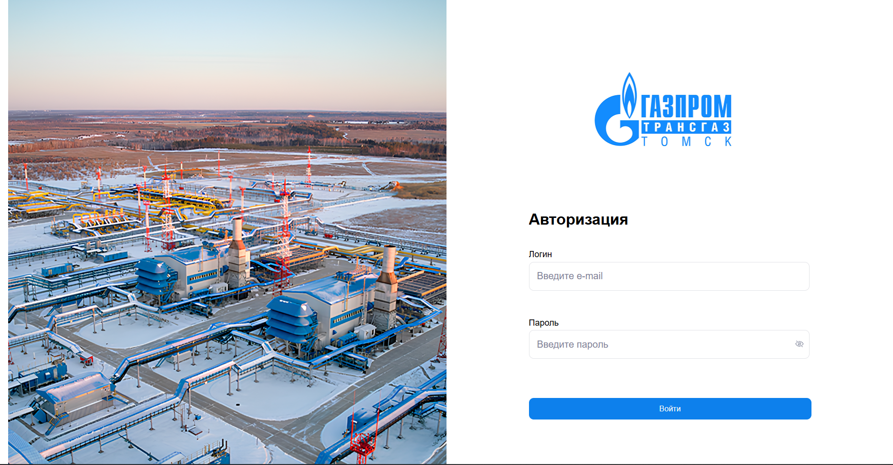
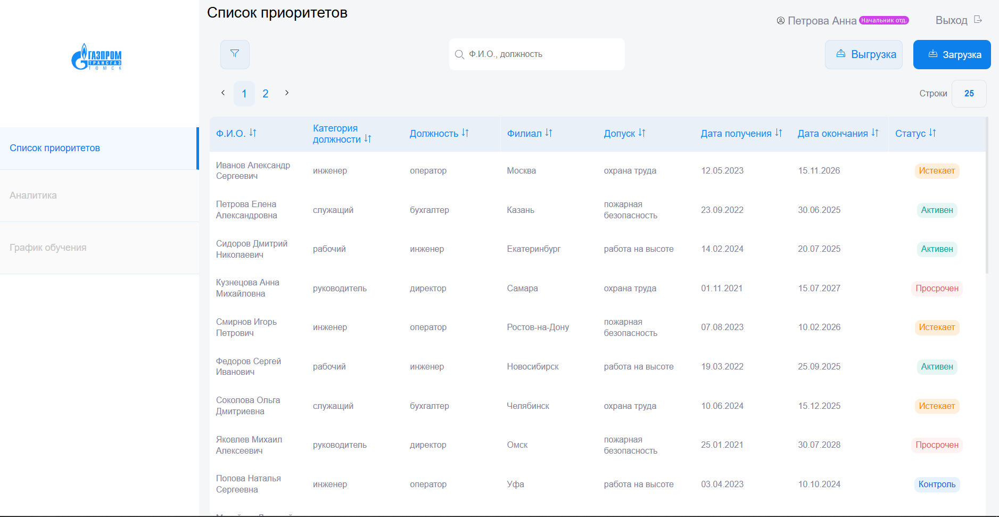

# AEPS

## О пректе

AEPS (Adaptive Edication Planning System) - программа для планирования процесса обучения персонала. Данные загружаются из Excel страниц выводятся удобочитаемом виде.

Данная программа разрабатывалась по заказу Томского филилала Газпромнефть.

### Функции

> [!NOTE]
> Для работы с Excel таблицами используется [PhpSpreadsheet](https://phpspreadsheet.readthedocs.io)

#### Admin

Панель администрирования для управления системой и справочниками.
> [!NOTE]
> Панель реализована на основе [MoonShine](https://moonshine-laravel.com) 

#### Auth

Используется Bearer токен с ограниченным временем действия.

#### Priority

Страница вычисления приоритетов обучения персонала из данных полученных из Excel таблиц.

### Внешние зависимости

#### Redis
Используется для временного хранения данных и быстрого доступа к ним.

#### MeiliSearch
Используется для идентификации доступа сотрудника из записи Excel.

### В планах

#### Training schedule
Страница для выявления коллизий и аномалий в принятом графике обучения

#### Analitics
Страница визуализации ключевых данных, связанных с обучением персонала

### Команда проекта

- **PM**: [Мария Окладникова](https://drive.google.com/file/d/10AcYWKZnt35-E8KA55kfMeKap3lzQswv/view)
- **SA**: [Ольга Щербакова](https://docs.google.com/document/u/0/d/1nPnHXSlv6Xe0Ugr8XJ2nWt9czFdG1J2VKYyDPYgwXzE/mobilebasic?pli=1)
- **UX/UI**: [Юлия Шевякова](https://drive.google.com/file/d/13uc8zswPE-Q9CWepEfvD2ERcf54oRe1M/view)
- **UX/UI**: [Мингалеева Дарья]()
- **Frontend**: [Кирилл Сербин](https://madridka.github.io/My-CV/cv-ru.html)
- **Backend**: [Алексей Побединский](https://rabota.by/resume/c3db36f7ff0c93e2d30039ed1f4a66726b645a)
- **QA**: Екатерина Дралова

<!-- ## Инструкция по установке Backend части:
1. Перейдите в директорию созданную для проекта и выполните команду:
> [!WARNING]
> Для выполнения этой команды нужен [Git](https://git-scm.com/downloads)
```
git clone https://gitlab.com/asap-dev1/nuzhnue-veshi/sapg/backend.git
```
или
```
git clone https://github.com/Sile9t/AdaptiveEducationPlanningSystem.git
```
2. Далее открывает проект в среде разработки и выполняем команды для установки всех зависимых пакетов
> [!WARNING]
> Для этого у вас предварительно должны быть установлены PHP(v8.2), Laravel(v10) [Git](https://git-scm.com/downloads)
```
composer install
npm -i
```
3. После того как все пакеты установятся выполните команду для создания записи администратора, указав свои [email], [username] и [password]:
```
php artisan moonshine:user -u email -N username -p password
``` -->